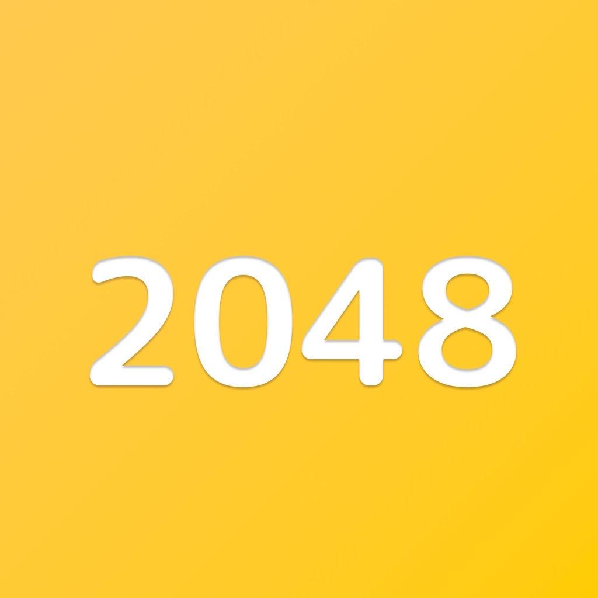

[![Swift Version][swift-image]][swift-url]

# 2048 Game - Numbers Game
 

  
  

        Join the numbers and get to the 2048 tile!
  

## Features

- [x] 4x4, 5x5, 6x6 game field
- [x] Custom Animation

## Requirements

- iOS 15.0+
- Xcode 13.0

## Meta

Sergey Petrov  – sergreypetrovmtgrey@gmail.com

Free to use.

[swift-image]:https://img.shields.io/badge/swift-5.7-orange.svg
[swift-url]: https://swift.org/
